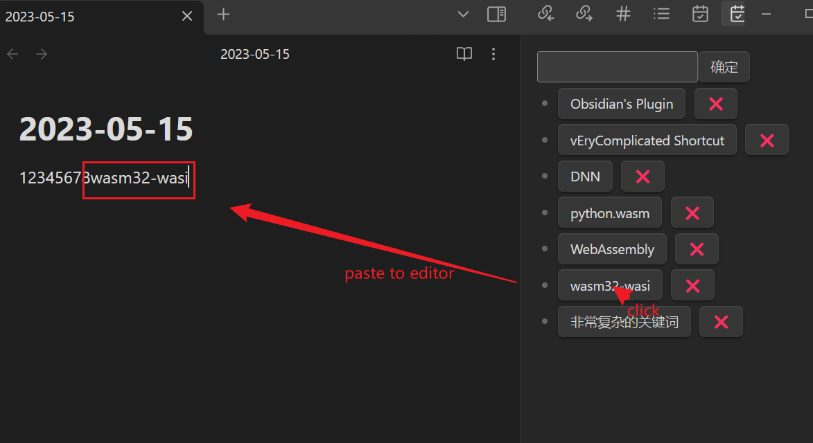

# obsidian keywords plugin

The plugin for article writing.

## Features

When you write a science and technology article, there are often some acronyms or abbreviations, and it will be more troublesome to enter these abbreviations every time. This plugin is used to simplify this operation, you can customize some keywords and insert articles directly after clicking.

当你写一篇科技文章时，经常会有一些术语或缩写，每次输入这些缩写都会比较麻烦。该插件用于简化此操作，您可以自定义一些关键字并在点击后直接插入文章。

